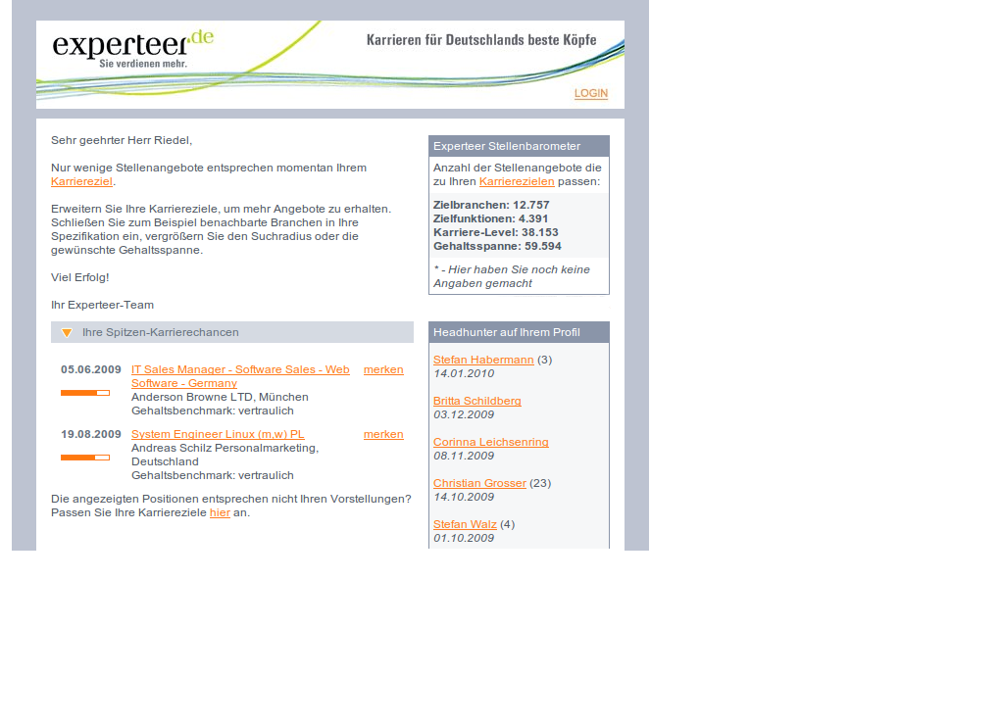
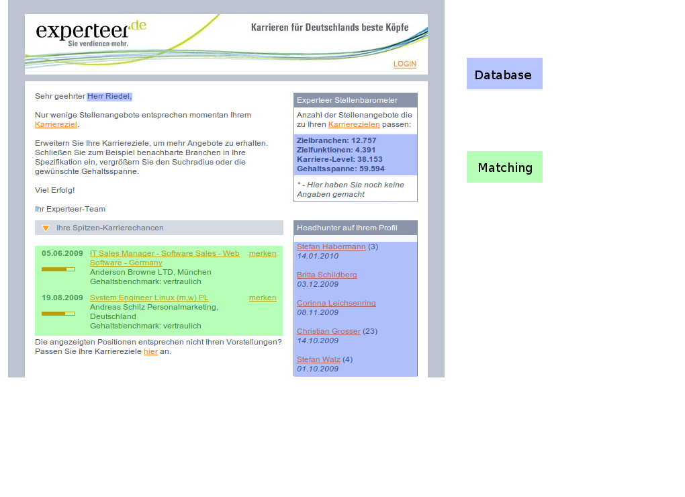

!SLIDE bullets 

# Ausgangslage #

* Rails 1.2.5
* Ruby 1.8.5
* GetText
* Postfix

!SLIDE bullets

# Ausgangslage #

* wöchentlicher Newsletterversand
* verschiedene Newsletter Typen 
* ca. 600.000 Empfänger (04/2009)
* Hier: Job Newsletter

!SLIDE 

# Warum In-House? #

!SLIDE 

# Alternativen #

!SLIDE bullets incremental

# Der Job Newsletter #

* keine Karriereziele definiert
* keine passenden Matching Ergebnisse
* passende Jobs gefunden

!SLIDE center

# Der Job Newsletter #

!SLIDE bullets

# Der Versendeprozess #

* Mitternacht via Cron
* An zwei Tagen
* 2 parallele Versandprozesse

!SLIDE bullets incremental

# Der Erstellungsprozess #
	
* Empfänger in Gruppen aus DB
* Job Matchings mit Karriereziele
* Gematchte Jobs aus DB
* Template wählen
* Rendern & Senden

!SLIDE center

# Anatomische Betrachtung #

