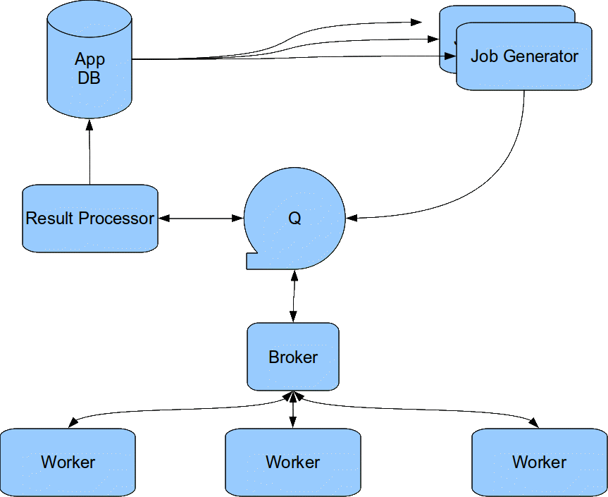
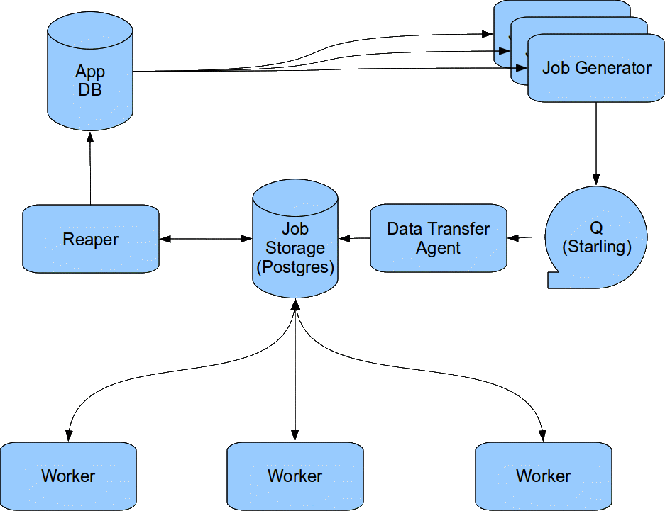

!SLIDE bullets

# Radikaler Umschwenk #

* Ansatz nicht skalierbar
* Neue Architektur nötig

!SLIDE bullets

# Ziele der neuen Architektur #

* Verteiltes System
* Serverpool einfach erweiterbar
* Mehrere Worker auf einem Server
* Dummer Master
* kein Threading!

!SLIDE center

!SLIDE center

!SLIDE bullets

# Verteilte Performance #

* Februar 2010
* 10 Worker Prozesse (1 Server)
* ca. 1.2 Mio Empfänger
* Laufzeit: 3h 20min 
* 50 Mails/s

!SLIDE bullets

# Verteilte Performance #

* Anfang März 2010
* 15 Worker Prozesse (2 Server)
* ca. 1.25 Mio Empfänger
* Laufzeit: 2h 20min
* 75 Mails/s

!SLIDE bullets

# Verteilte Performance #

* Ende März 2010
* 19 Worker Prozesse (2 Server)
* ca. 1.3 Mio Empfänger
* Laufzeit: 2h 
* 90 Mails/s

