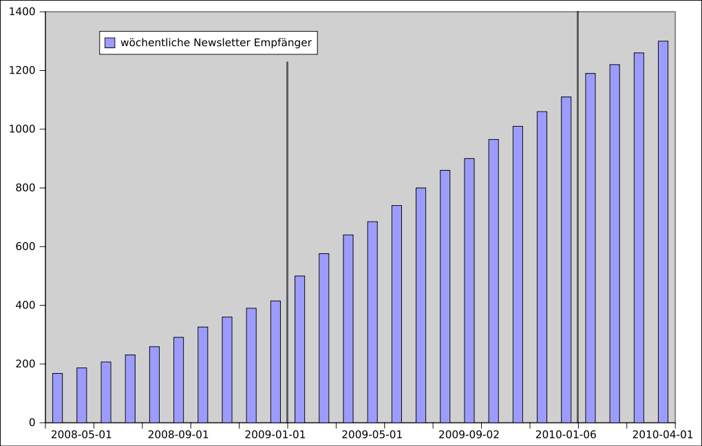
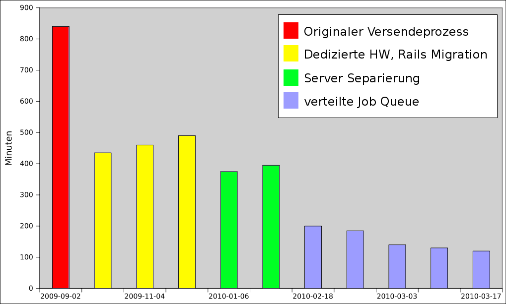
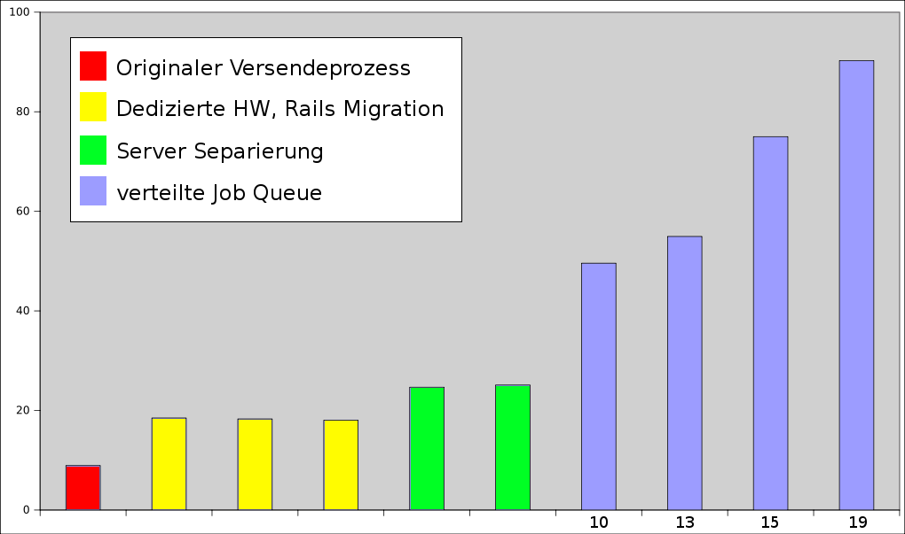

!SLIDE center

!SLIDE center

!SLIDE center

!SLIDE bullets incremental

# Learnings #

* Threading kann helfen
* Problematisch im Rails Umfeld
* Multi-Processing ist oft besser
* Verteilte Systeme sind immer besser

!SLIDE bullets incremental

# Learnings #

* Stakeholder: Was ist schnell genug?
* Automatisierte Kennzahlen Überwachung

!SLIDE bullets
# Learnings #
* Don\'t tweak - change!

!SLIDE
# ? #
